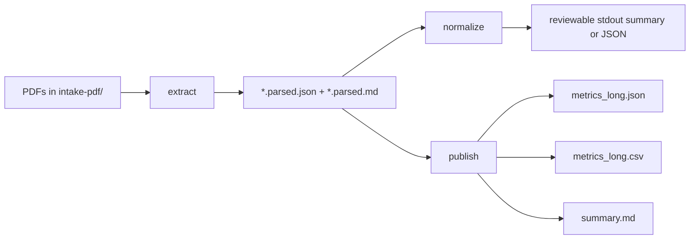

# Sagard Portfolio Metric Extractor

CLI-first proof of concept for extracting a small, defensible set of portfolio company metrics from quarterly PDF updates.

This demo is intentionally scoped like a take-home or interview exercise: it favors **trust, clear tradeoffs, and reproducibility** over UI polish or broad feature coverage.

## What this demo is about

The problem is simple to describe and annoyingly manual in real life:

- portfolio companies send quarterly updates as PDFs
- the metrics are useful, but the labels and formatting vary by company and quarter
- someone still has to read them, normalize them, and assemble a reviewable output

Concrete example: Sagard receives a batch of quarterly PDF updates, one company calls the metric `ARR`, another calls it `Annual Recurring Revenue`, and another buries it inside a table with different formatting. This demo shows how to turn those inconsistent source documents into one auditable export with stable canonical fields.

This repository demonstrates a pragmatic pipeline that:

1. **extracts** text from local PDFs
2. **detects and normalizes** a small set of metrics conservatively
3. **publishes** portable output artifacts for downstream review

The design point is:

- **pragmatism over parser purity**
- **correctness over coverage**
- **portability over presentation polish**

In other words: better an honest, auditable JSON export than a flashy demo that quietly invents finance numbers. That way lies chaos, and awkward follow-up questions.

## What the demo currently does

Implemented today:

- reproducible Python packaging with a CLI entrypoint
- environment-driven parser configuration via `.env`
- preflight checks for local readiness
- a parser abstraction with **Firecrawl-first** posture and **local fallback**
- deterministic detection and numeric parsing for the metric normalization layer
- a publish step that writes canonical Phase 4 artifacts
- test and lint coverage with `pytest` and `ruff`

Intentionally not implemented yet:

- Phase 5 validation and hardening work
- richer human review workflows
- a web app, API, or persistent database

## Metrics in scope

Core metrics:

- `revenue_qtr`
- `arr_eop`
- `gross_margin_pct`
- `cash_balance`
- `monthly_burn`
- `headcount`

Optional metrics already supported by the normalization layer:

- `net_revenue_retention_pct`
- `logo_churn_pct`

## End-to-end flow



## Local machine prerequisites

You only need a few things to run this locally:

- Python **3.12+**
- a shell environment such as bash or zsh
- optional provider keys if you want Firecrawl instead of the local parser

You do **not** need:

- Node.js
- Docker
- a database
- cloud infrastructure

The repository already includes sample PDFs in `intake-pdf/`, including files such as:

- `NovaCloud_Q2_2025.pdf`
- `LendBridge_Q2_2025.pdf`
- `Portfolio_Snapshot_Q2_2025.pdf`

Those are enough to run the demo locally.

## Local setup

The easiest setup path is now:

```bash
cd personal/sagard-portfolio-metric-extractor
make setup
```

That command will:

- create `.venv/` if it does not exist
- upgrade `pip` inside the virtual environment
- install the project and dev dependencies
- create `.env` from `.env.example` if `.env` is missing

If you want to do the setup manually, from the project root:

```bash
cd personal/sagard-portfolio-metric-extractor
python3 -m venv .venv
source .venv/bin/activate
python -m pip install --upgrade pip
python -m pip install -e ".[dev]"
cp .env.example .env
```

If you are on PowerShell, activate the environment with:

```powershell
.venv\Scripts\Activate.ps1
```

### Optional configuration

The project reads settings from `.env`.

Relevant variables:

- `PDF_PARSER=firecrawl|local`
- `FIRECRAWL_API_KEY=...`
- `FIRECRAWL_PDF_MODE=fast|auto|ocr`
- `OPENAI_API_KEY=...` (currently optional)
- Azure Document Intelligence settings are present but not required for the local demo

Good first-run options:

- leave `PDF_PARSER=firecrawl` and rely on automatic fallback to the local parser if no Firecrawl key is set
- or set `PDF_PARSER=local` if you want a fully local first pass

Quick install verification:

```bash
python -m portfolio_metrics preflight --input-dir intake-pdf --output-dir outputs
```

## API keys you actually need

Short version: **none are required for the local demo**.

If you want the quickest local path, use either:

- `make demo` for the fixture-based path, or
- `make full-demo` for the raw-PDF path using the local parser

Both work without any external API keys.

### Required for the local demo

- **No API keys required**

### Optional keys

- `FIRECRAWL_API_KEY` — needed only if you want Firecrawl instead of the local parser; otherwise the code can fall back to local parsing
- `OPENAI_API_KEY` — currently **not required** for the implemented demo flow; reserved for future or optional AI-assisted steps
- `AZURE_DOCUMENT_INTELLIGENCE_ENDPOINT` + `AZURE_DOCUMENT_INTELLIGENCE_KEY` — currently **not required** for the implemented local demo; included as a future production-forward option

For a zero-key local setup, a good `.env` choice is simply:

```dotenv
PDF_PARSER=local
```

## Fastest way to try the demo locally

If you want to verify the pipeline quickly, use the checked-in parsed fixtures instead of re-parsing PDFs.

Those fixtures are cached Phase 2 outputs, which makes them useful for quickly testing Phases 3 and 4 without waiting on raw PDF parsing again.

### Simplest path

```bash
make demo
```

That one command will set up the virtual environment if needed, run preflight, and generate:

- `outputs/metrics_long.json`
- `outputs/metrics_long.csv`
- `outputs/summary.md`

### Manual equivalent

Run:

```bash
python -m portfolio_metrics preflight --input-dir intake-pdf --output-dir outputs
python -m portfolio_metrics publish --input-dir tests/fixtures/parsed --output-dir outputs --include-csv --include-summary
```

This path is ideal when you want to confirm that:

- the environment is working
- the normalization layer is working
- the Phase 4 export artifacts are being generated correctly

Generated artifacts will appear in `outputs/`:

- `metrics_long.json`
- `metrics_long.csv`
- `summary.md`

## Run the full demo from raw PDFs

If you want the full pipeline from source PDFs to final export, the simplest path is:

```bash
make full-demo
```

### Manual equivalent from raw PDFs

If you want the full pipeline from source PDFs to final export without Make, run:

```bash
python -m portfolio_metrics preflight --input-dir intake-pdf --output-dir outputs
python -m portfolio_metrics extract intake-pdf --output-dir outputs/parsed --parser local
python -m portfolio_metrics publish --input-dir outputs/parsed --output-dir outputs --include-csv --include-summary
```

Notes:

- `extract` reads raw PDFs and writes Phase 2 artifacts to `outputs/parsed/`
- `normalize` remains available when you want a review summary on stdout, but it is not required before `publish`
- `publish` reads parsed inputs, runs normalization internally, and writes persisted Phase 4 outputs
- if you configure Firecrawl, you can omit `--parser local` and use the default parser strategy
- the bare CLI command `portfolio_metrics extract` without explicit file or directory arguments uses a representative 3-document sample by design; passing `intake-pdf` explicitly processes the whole folder

## How to test it on a local machine

The shortest check is:

```bash
make check
```

That runs both tests and linting.

Recommended smoke test after that:

```bash
make demo
```

### Manual equivalent for checks

Run the automated checks:

```bash
python -m pytest
python -m ruff check portfolio_metrics tests
```

Recommended smoke test after that:

```bash
python -m portfolio_metrics publish --input-dir tests/fixtures/parsed --output-dir outputs --include-csv --include-summary
```

That combination verifies:

- unit and integration-style tests
- linting for the Python package and tests
- the end-to-end Phase 4 export path on representative fixture data

## Make targets

The `Makefile` now manages `.venv` for you, so you do **not** need to activate the virtual environment first.

Recommended shortcuts:

- `make setup` — create `.venv`, install dependencies, and seed `.env` if needed
- `make demo` — fastest end-to-end local demo using checked-in parsed fixtures
- `make full-demo` — full raw-PDF flow using the local parser
- `make check` — run `pytest` and `ruff`

Other shortcuts:

- `make install` — alias for setup
- `make run` — alias for `make demo`
- `make preflight` — validate local readiness
- `make extract` — parse **all PDFs** from `intake-pdf/` into `outputs/parsed/`
- `make extract-fixtures` — regenerate the checked-in parsed fixtures using the local parser
- `make normalize` — print the normalization summary for parsed artifacts in `outputs/parsed/`
- `make publish` — publish `metrics_long.json`, `metrics_long.csv`, and `summary.md`
- `make test` — run `pytest`
- `make lint` — run `ruff`

## Output artifacts

### `outputs/parsed/<name>.parsed.json`

Stable parser output consumed by later phases.

### `outputs/parsed/<name>.parsed.md`

Human-readable parsed view with provenance notes.

### `outputs/metrics_long.json`

Canonical long-form export with:

- export metadata
- normalized metric rows
- carried-forward issues and warnings
- provenance and confidence on each metric row

### `outputs/metrics_long.csv`

Spreadsheet-friendly projection of the canonical JSON export.

### `outputs/summary.md`

Lightweight human-readable summary derived from the canonical export.

## Provenance strategy

The project keeps provenance explicit without pretending to know more than the parser really knows.

- **Local parser**: file-level and page-level provenance
- **Firecrawl parser**: file-level provenance plus page count metadata when available
- **Phase 3 normalization**: captures nearby snippets for metric-level provenance

This keeps the extraction contract honest and makes downstream review easier.

## Repository layout

```text
sagard-portfolio-metric-extractor/
├── intake-pdf/
├── outputs/
│   ├── metrics_long.json
│   ├── metrics_long.csv
│   ├── summary.md
│   └── parsed/
├── plan/
├── spec/
├── options/
├── portfolio_metrics/
│   ├── cli.py
│   ├── detect_metrics.py
│   ├── extract_text.py
│   ├── metric_aliases.py
│   ├── normalize.py
│   ├── parse_values.py
│   ├── parser.py
│   ├── parser_firecrawl.py
│   ├── parser_local.py
│   ├── pipeline.py
│   ├── publish.py
│   └── schema.py
├── tests/
│   └── fixtures/
│       └── parsed/
├── .env.example
├── .gitignore
├── Makefile
├── pyproject.toml
└── README.md
```

## Current status

Phase 4 artifact publishing is implemented and working locally.

Recently validated on a local machine with:

- `python -m pytest`
- `python -m ruff check portfolio_metrics tests`
- `python -m portfolio_metrics publish --input-dir tests/fixtures/parsed --output-dir outputs --include-csv --include-summary`

## Next step

The next logical phase is to harden validation quality, tighten review workflows, and improve confidence around edge cases and corpus drift.
