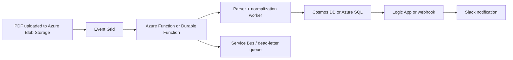

# Architecture Options and Tradeoffs — Portfolio Metrics Extraction

> **Status**: Draft v2.
> **Purpose**: Focus the architecture conversation on the three decisions that actually matter in the interview.

---

## 1. The three architecture decisions that matter most

This challenge does **not** need a giant architecture review. It needs three clear decisions, each with a defensible tradeoff:

| Decision         | Core question                                                                          | Main options                                     | Recommended choice                                               |
| ---------------- | -------------------------------------------------------------------------------------- | ------------------------------------------------ | ---------------------------------------------------------------- |
| **1. Extract**   | How do we turn local PDFs into trustworthy text or structured content?                 | Firecrawl, local parser, Azure DI                | **Firecrawl-first** for the POC, with a local-parser abstraction |
| **2. Normalize** | How do we parse values safely and handle ambiguous labels, missing fields, and errors? | rules-only, LLM-first, hybrid                    | **Hybrid conservative normalization**                            |
| **3. Present**   | What artifact should the system emit so it is useful now and extensible later?         | JSON only, JSON + review artifacts, API/UI first | **JSON-first**, with optional review artifacts                   |

The interview story becomes much cleaner if everything is framed around those three decisions instead of around five or six disconnected tools.

---

## 2. Decision 1 — How to extract the data from the PDF

### Extraction problem to solve

Before we can reason about metrics, we need a dependable PDF-to-text or PDF-to-structured-content layer. The sample corpus looks mostly text-extractable, so the real question is not “can we OCR everything?” but “what parser gets us to trustworthy downstream normalization fastest?”

### Option A — Firecrawl `/parse` (**recommended for the POC**)

#### Firecrawl strengths

- Supports **local PDFs**, which matches the challenge input directly.
- Offers `fast`, `auto`, and `ocr` modes.
- Returns Markdown or JSON quickly.
- Lets the implementation focus on **normalization, provenance, and trust** rather than on low-level PDF plumbing.

#### Firecrawl tradeoffs

- Adds an external API dependency and usage cost.
- Page boundaries and provenance may be less explicit than with a fully local page-aware parser.
- Upload happens per file, so very large batch throughput may require extra orchestration later.

### Option B — Local page-aware parser (`PyMuPDF` or `pdfplumber`)

#### Local parser strengths

- Full local control.
- Easier page-level provenance.
- No vendor lock or per-call usage cost.
- Strong “boring but trustworthy” engineering story.

#### Local parser tradeoffs

- More implementation effort.
- More time spent on page segmentation and layout quirks.
- Slower route to an interview-ready proof of concept in a short time box.

### Option C — Azure Document Intelligence `prebuilt-layout`

#### Azure DI strengths

- Strongest layout-aware and table-aware option.
- Better fit for scanned, rotated, or visually complex PDFs.
- Best production-forward story if document quality varies a lot.

#### Azure DI tradeoffs

- More Azure setup than the take-home needs on day one.
- More infrastructure weight in the story.
- Better as a documented upgrade path than as the first move.

### Extraction recommendation for this challenge

Use **Firecrawl `/parse` as the primary parser for the POC**, but keep the parser contract small so a **local parser can be swapped in later**.

This gives the right balance of:

- speed,
- interview defensibility,
- and future flexibility.

### Extraction tradeoff phrasing

> I optimized for **time-to-trust**, not parser purity. Firecrawl gets me usable structured text quickly, and I kept the parser abstraction small so I can swap to a local parser or Azure DI later if provenance or layout fidelity becomes more important.

---

## 3. Decision 2 — How to normalize, parse, and handle edge cases

### Normalization problem to solve

This is the real heart of the challenge. The PDFs do not just contain numbers; they contain **different labels, inconsistent units, overlapping definitions, and occasional ambiguity**. A strong solution must decide where normalization is safe, where it is unsafe, and how errors are surfaced.

### Option A — Pure rules only

#### Rules-only strengths

- Fully deterministic.
- Easy to test.
- Easy to explain.

#### Rules-only tradeoffs

- Can become brittle when labels drift.
- Harder to handle semantically similar but non-equivalent labels.
- More rule-writing than it first appears.

### Option B — LLM-first extraction and normalization

#### LLM-first strengths

- Fast to prototype.
- Handles wording variation well.
- Good semantic flexibility.

#### LLM-first tradeoffs

- Harder to trust for numeric extraction.
- Harder to keep provenance tight.
- Higher hallucination and over-normalization risk.

### Option C — Hybrid conservative pipeline (**recommended**)

#### Hybrid-pipeline strengths

- Keeps **numeric parsing deterministic**.
- Uses normalization rules where concepts are clearly equivalent.
- Leaves room for AI only where ambiguity genuinely exists.
- Preserves an honest story around confidence and review.

#### Hybrid-pipeline tradeoffs

- Slightly more architecture work up front.
- Requires a clean separation between detection, parsing, and normalization.

### Recommended normalization contract

The best contract for this challenge is:

1. **Candidate detection first**
   - alias dictionary
   - nearby-value matching
   - source snippet capture
2. **Deterministic numeric parsing**
   - currency (`$34.2M`, `$81k`)
   - percentages (`78%`)
   - negatives (`($0.55M)`)
   - multipliers (`2.7x`)
   - basis points (`+148bps`)
3. **Conservative canonical mapping**
   - normalize only clearly equivalent metrics
   - keep `raw_label` always
   - add `confidence` and `notes` when equivalence is imperfect
4. **Optional semantic helper only for ambiguous labels**
   - never let AI invent the numeric value
   - use it only to classify borderline metric names

### Edge cases and error-handling policy

This is worth saying explicitly because it shows judgment:

- **Missing metric** → omit the row or mark as missing; do not fabricate null semantics.
- **Multiple candidate values** → keep the highest-confidence candidate and store a note if the choice was contested.
- **Non-equivalent labels** → keep the raw label and do not force a canonical metric if the mapping is unsafe.
- **Mixed units** → parse to a typed internal representation and preserve the display string.
- **Portfolio summary duplication** → tag summary documents separately so duplicated portfolio metrics do not silently blend with company-level reports.
- **Parser/API failure** → record extraction failure for that file and continue the batch rather than failing the whole run.
- **Weak provenance** → keep `source_file` + `source_snippet` at minimum, and `source_page` whenever available.

### Normalization tradeoff phrasing

> I chose **correctness over coverage**. In finance, bad normalization is worse than incomplete normalization, so I parse numbers deterministically, normalize only where the semantics are safe, and preserve raw labels plus confidence for everything else.

---

## 4. Decision 3 — How to present the data

### Presentation problem to solve

The extracted data should be easy to consume now, but it should also leave room for a future API, dashboard, or downstream workflow. The output format should not lock the project into a presentation layer too early.

### Option A — JSON only (**recommended baseline**)

#### JSON-only strengths

- Best fit for a script-first architecture.
- Easiest bridge to a future API.
- Preserves nested provenance cleanly.
- Avoids spending time on presentation polish too early.

#### JSON-only tradeoffs

- Less friendly for non-technical reviewers than a flat spreadsheet.
- Harder to skim quickly without a helper script or viewer.

### Option B — JSON plus CSV and/or markdown review artifacts

#### JSON-plus-review strengths

- JSON remains the canonical artifact.
- CSV is easy to inspect in Excel or Sheets.
- Markdown creates a cleaner interview demo surface.

#### JSON-plus-review tradeoffs

- Slightly more implementation work.
- Easy to drift into presentation work instead of extraction quality.

### Option C — API, dashboard, or UI first

#### API-or-UI-first strengths

- More visually impressive.
- Closer to a polished product surface.

#### API-or-UI-first tradeoffs

- Wrong shape for the take-home.
- Increases scope before the extraction contract is stable.
- Mixes infrastructure work with the actual hard problem.

### Presentation recommendation for this challenge

Use **JSON as the canonical output**.

If there is time left, derive one lightweight review artifact from the same JSON:

- a CSV for spreadsheet review, or
- a short markdown summary for the interview.

That keeps the design honest: **presentation stays downstream of the extraction contract**.

### Presentation tradeoff phrasing

> I chose **portability over polish** for v1. JSON is the cleanest contract for a future API or dashboard, and any human-facing presentation can be derived from the same output later.

---

## 5. Chosen architecture for this challenge

| Part          | Chosen architecture                                                 | Why it fits                    | Main tradeoff                         |
| ------------- | ------------------------------------------------------------------- | ------------------------------ | ------------------------------------- |
| **Extract**   | Firecrawl-first, small parser abstraction, Azure DI documented only | Fastest path to a credible POC | speed vs. local control               |
| **Normalize** | Deterministic detection + numeric parsing + conservative mapping    | Strongest trust story          | correctness vs. coverage              |
| **Present**   | JSON-first output, optional review artifact later                   | Clean bridge to a future API   | portability vs. immediate readability |

If you want one sentence to anchor the whole interview, make it this:

> I made three core decisions: **pragmatism over parser purity**, **correctness over coverage**, and **portability over presentation polish**.

---

## 6. What changes in production on Azure

### Questions to ask the interviewer first

Before locking a production design, ask:

1. **Who is using this?** Analysts, portfolio-ops, investment team, or company operators?
2. **How many PDFs arrive per quarter or per month?**
3. **Are uploads bursty?** For example, do most files arrive at quarter end?
4. **How fast do results need to appear?** Minutes, hours, same day?
5. **Who reviews low-confidence extractions?**
6. **Where do the metrics live downstream?** Dashboard, warehouse, Slack, internal app?
7. **How important is auditability or compliance?**

Those answers determine whether you need a queue, human review workflow, stronger storage guarantees, or a more flexible schema.

### Recommended Azure event-driven architecture

Recommended production flow:

1. A PDF lands in **Azure Blob Storage**.
2. **Event Grid** emits a blob-created event.
3. An **Azure Function** or **Durable Function** starts the extraction job.
4. If volume is high or runtime is long, the function pushes work onto **Service Bus** for queued processing.
5. Raw parser output and normalized metrics are stored in **Cosmos DB** or **Azure SQL**, depending on downstream query needs.
6. A **Logic App** or webhook posts a summary to **Slack**, including low-confidence flags when needed.
7. Failures route to a dead-letter queue for human review.

### Main production tradeoffs

- **Async vs. sync**: async is the right shape for bursty PDF workloads; sync is simpler but brittle under volume.
- **Serverless vs. always-on workers**: serverless is operationally lighter, but cold starts and timeouts matter for heavy documents.
- **Cosmos DB vs. SQL**: Cosmos is more flexible for evolving schemas; SQL is better if downstream reporting is strongly relational.
- **Slack as a notification vs. source of truth**: Slack is useful for visibility, but storage must remain the real system of record.

### Best way to say the production tradeoff out loud

> In production, I would move this to an **event-driven Azure pipeline**: blob upload, async extraction, durable storage, and Slack notification. PDF parsing is a bursty workload, so I would not make users wait inside a synchronous web request if I can avoid it.

---

## 7. Final recommendation

If I were approving the architecture, I would approve this:

1. **CLI-first Python implementation**
2. **Firecrawl `/parse` as the primary POC parser**
3. **Deterministic numeric parsing and conservative normalization**
4. **JSON as the canonical output artifact**
5. **Optional CSV or markdown only if it helps the review conversation**
6. **Azure Blob Storage → Event Grid → Functions → Cosmos/SQL → Slack** as the production-forward story

That is the best balance of speed, trust, extensibility, and interview clarity.
