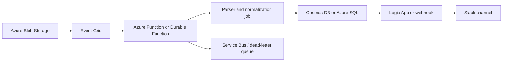

# PLAN — Portfolio Metrics Extraction

> **Status**: Draft v2.
> **Builds the spec at**: `../spec/SPEC.md`.
> **Companion tradeoff doc**: `../options/ARCHITECTURE_OPTIONS.md`.
> **Goal**: Ship a small, credible proof of concept that is easy to defend in a technical interview.

---

## Reading guide

This plan is now organized around three things:

1. **The three architecture decisions** you need to defend.
2. **A phased implementation plan** that keeps scope tight.
3. **A production-forward Azure path** that is credible without overbuilding the take-home.

---

## 0. Lock the architecture before writing code

The most important planning move is to lock the three decisions that define the build.

### Decision 1 — PDF extraction

- **Chosen**: Firecrawl-first parser posture.
- **Fallback**: local parser abstraction for future swapability.
- **Documented future path**: Azure Document Intelligence for layout-heavy or scanned documents.

### Decision 2 — Normalization, parsing, and error handling

- **Chosen**: deterministic candidate detection + deterministic numeric parsing + conservative normalization.
- **Optional only**: use AI for ambiguous label classification, not for raw numeric extraction.

### Decision 3 — Presentation/output contract

- **Chosen**: JSON-first output.
- **Optional later**: CSV or markdown generated from the same JSON if it helps review or demo quality.

### Other constraints already locked

- **Track 2** is the recommended path.
- Deliver a **CLI or small Python script**, not a server and not a notebook-dependent workflow.
- Extract the **core six metrics first**, with `net_revenue_retention` as the first optional extension.
- Keep provenance explicit even if page mapping is imperfect.

If these are not locked first, scope creep will absolutely show up wearing a fake mustache and pretending to be a “small improvement.”

---

## 1. Recommended implementation path

### Track 1 — Conservative local CLI (2–3 hours)

Use a local parser, deterministic detection, and JSON output only.

#### Track 1 best for

- strongest local-control story
- minimal dependencies
- simpler provenance handling

#### Track 1 main downside

- more time spent on parser details than on normalization and tradeoffs

### Track 2 — Firecrawl-first hybrid CLI (4–6 hours) **recommended**

Use Firecrawl for the PDF-to-text layer, then keep extraction and normalization deterministic wherever trust matters.

#### Track 2 best for

- strongest interview story
- fastest route to a reviewable proof of concept
- clean separation between parser choice and downstream logic

#### Track 2 main downside

- adds a vendor dependency and slightly weaker page-level control unless you reconstruct provenance carefully

### Why Track 2 is still the right recommendation

It demonstrates:

- modern-tool pragmatism,
- trust-aware engineering judgment,
- and a clean production-forward evolution path.

---

## 2. Phase-by-phase execution plan

### Phase 0 — Pre-flight and corpus audit (30–45 min)

#### Phase 0 goals

- inspect representative PDFs
- confirm the corpus is text-extractable
- finalize the metric taxonomy
- lock the three architecture decisions

#### Phase 0 deliverables

- final metric list
- extraction posture confirmed
- normalization posture confirmed
- JSON-first presentation contract confirmed
- short notes on label aliases seen in the corpus

#### Phase 0 exit criteria

- you can explain why OCR is not the day-one baseline
- you can explain why JSON is the canonical output instead of a UI

### Phase 1 — Bootstrap repository skeleton (30–45 min)

#### Phase 1 goals

Create the minimum repo structure needed to support a clean CLI build.

#### Phase 1 deliverables

- `pyproject.toml`
- `.env`, `.env.example`, and `.gitignore`
- `portfolio_metrics/`
- `README.md` placeholder
- `outputs/` directory contract
- `tests/` directory
- CLI entry point or `main.py`

#### Phase 1 exit criteria

- there is one obvious run command
- environment setup is reproducible

### Phase 2 — Build the extraction layer on representative PDFs (60–90 min)

#### Phase 2 goals

- turn PDFs into text or markdown
- preserve enough source structure for downstream provenance
- keep parser logic behind a simple interface

#### Representative PDFs

- `NovaCloud_Q2_2025.pdf`
- `LendBridge_Q2_2025.pdf`
- `Portfolio_Snapshot_Q2_2025.pdf`

#### Phase 2 deliverables

- parser wrapper (`parser_firecrawl.py` or local equivalent)
- extracted text/markdown fixtures for a few PDFs
- file-level and page-level provenance strategy documented

#### Phase 2 exit criteria

- representative PDFs parse consistently
- the parser contract is stable enough that the normalization layer can ignore parser internals

### Phase 3 — Build normalization, parsing, and error handling (60–90 min)

#### Phase 3 goals

- detect candidate metric/value pairs
- parse numeric formats safely
- handle ambiguity and missingness without hiding it

#### Phase 3 deliverables

- alias dictionary
- deterministic value parser
- canonical metric mapper
- confidence / notes strategy
- error handling for missing metrics, parse failures, and conflicting candidates

#### Phase 3 exit criteria

- core metrics extract correctly on representative PDFs
- ambiguous cases remain visible instead of being silently normalized away

### Phase 4 — Generate the canonical output artifact (30–45 min)

#### Phase 4 goals

- produce a stable JSON contract that can be reused later
- optionally derive one human-readable artifact if time permits

#### Phase 4 deliverables

- `metrics_long.json`
- optional `metrics_long.csv`
- optional `summary.md`

#### Phase 4 exit criteria

- JSON rows are consistent across the corpus
- every row carries provenance and confidence

### Phase 5 — Validate and harden the baseline (45–60 min)

#### Phase 5 goals

- manually review a small gold set
- tighten mappings
- verify that edge-case handling is honest

#### Phase 5 deliverables

- small validation set
- improved mappings
- documented limitations

#### Phase 5 exit criteria

- you can name where the system is strong
- you can name where it still needs human review

### Phase 6 — Package the story for review (30–45 min)

#### Phase 6 goals

- make the tradeoffs easy to explain
- keep the write-up as strong as the code

#### Phase 6 deliverables

- README with run instructions
- short note on assumptions / limitations / future work
- interview walkthrough artifacts

#### Phase 6 exit criteria

- a reviewer can understand the build without opening the whole codebase first

---

## 3. Recommended file and module layout

```text
sagard-portfolio-metric-extractor/
├── intake-pdf/
├── outputs/
│   ├── metrics_long.json
│   ├── metrics_long.csv
│   └── summary.md
├── portfolio_metrics/
│   ├── __init__.py
│   ├── cli.py
│   ├── extract_text.py
│   ├── parser_firecrawl.py
│   ├── parser_local.py
│   ├── metric_aliases.py
│   ├── detect_metrics.py
│   ├── normalize.py
│   ├── schema.py
│   └── pipeline.py
├── tests/
│   ├── test_value_parser.py
│   └── test_normalization.py
├── .env
├── .env.example
├── .gitignore
├── README.md
├── pyproject.toml
└── plan/
    ├── PLAN.md
    ├── INTERVIEW_GUIDE.md
    └── PUSHBACK_CHEATSHEET.md
```

`metrics_long.json` is the canonical artifact. CSV and markdown are optional derivatives.

---

## 4. Go / no-go gates

### Gate 1 — After Phase 2

**Question**: Can the chosen parser reliably produce text or markdown for representative PDFs?

#### Gate 1 if yes

Move to normalization.

#### Gate 1 if no

Do **not** add AI or presentation polish yet.

Instead:

- simplify parser assumptions
- test the local fallback
- reduce scope until extraction is stable

### Gate 2 — After Phase 3

**Question**: Can the pipeline detect and parse the core metrics without hiding ambiguity?

#### Gate 2 if yes

Generate the canonical JSON output.

#### Gate 2 if no

Do **not** build extra presentation layers.

Instead:

- tighten aliases
- reduce metric scope
- improve error handling

### Gate 3 — Before adding review artifacts

**Question**: Is the JSON output already good enough to defend?

#### Gate 3 if yes

Only add CSV or markdown if it clearly improves the interview conversation.

#### Gate 3 if no

Fix the data contract before improving presentation.

---

## 5. Stretch goals in priority order

Only attempt these if the baseline path is already stable.

### Stretch 1 — Optional markdown summary

Add a compact review artifact derived from the JSON output.

### Stretch 2 — Small validation harness

Hand-check a few PDFs and compare expected metrics to extractor output.

### Stretch 3 — Local parser fallback comparison

Compare Firecrawl output with a local parser and document where each wins.

### Stretch 4 — Azure DI spike on one difficult document

Only worthwhile if one PDF clearly needs stronger layout handling.

### Stretch 5 — Optional LLM ambiguity resolver

Use a model only for borderline label normalization, never for raw value extraction.

---

## 6. Technical decisions to lock early

### 6.1 Canonical metric set

Recommended default:

- `revenue_qtr`
- `arr_eop`
- `gross_margin_pct`
- `cash_balance`
- `monthly_burn`
- `headcount`
- `net_revenue_retention_pct` (first optional extension)
- `logo_churn_pct` (optional)

### 6.2 Numeric parsing rules

The parser must explicitly handle:

- currency shorthand (`$34.2M`, `$81k`)
- percentages (`78%`)
- negatives in parentheses (`($0.55M)`)
- multipliers (`2.7x`)
- basis points (`+148bps`)

### 6.3 Provenance contract

Every output row should carry at minimum:

- `source_file`
- `source_page` where available
- `raw_label`
- `source_snippet`

Pragmatic v1 note: if Firecrawl is the primary parser and strict page mapping becomes expensive, **file + snippet provenance is acceptable for v1**, as long as that limitation is stated explicitly.

---

## 7. Testing strategy

Keep testing proportionate.

### Must-have tests

- value parser tests
- normalization mapping tests
- one integration-style test on a small text fixture

### Nice-to-have tests

- end-to-end sample PDF smoke test
- regression fixtures for tricky labels

### Do not do

- large harnesses before the extraction contract works
- UI work before the JSON contract is stable

---

## 8. Interview prep notes

The strongest themes to emphasize are:

1. you inspected the sample corpus before choosing technology
2. you framed the design around **three explicit decisions**
3. you treated provenance as a first-class requirement
4. you separated extraction from presentation
5. you reserved AI for ambiguity, not for blind number generation
6. you kept the delivery shape as a script because synchronous UI or API work is the wrong first scaling move

### Assumptions to say out loud

- the sample corpus is mostly text-extractable, so OCR is not the day-one baseline
- six metrics are enough to prove the concept
- some company-specific metrics will remain raw or low-confidence in v1
- JSON is the source-of-truth output; any presentation layer can sit on top later

### Questions you should be ready to answer

- Why these metrics and not others?
- Why Firecrawl now and Azure DI later?
- Why not LLM everything?
- Why JSON first instead of an app?
- What breaks first in production?
- How would you extend this to scanned PDFs?

---

## 9. My recommended order of attack for you specifically

If I were pairing with you live, I would do this in order:

1. lock the core six metrics
2. lock Firecrawl-first vs local-first parser posture
3. build the parser wrapper
4. build deterministic normalization and error handling
5. generate one clean JSON output across the sample corpus
6. only then add CSV, markdown, or optional AI assistance if it helps the review conversation

That order maximizes the chance that the result is both runnable and defendable.

---

## 10. Next artifacts I would create after plan approval

- `README.md` scaffold
- `pyproject.toml`
- `portfolio_metrics/schema.py`
- `portfolio_metrics/metric_aliases.py`
- `portfolio_metrics/extract_text.py`
- `portfolio_metrics/parser_firecrawl.py`
- `portfolio_metrics/pipeline.py`
- `tests/test_value_parser.py`

---

## 11. Production graduation path on Azure

### Questions to ask the interviewer first

1. Who is the primary user of the system?
2. How many PDFs arrive per quarter, and how bursty is intake?
3. How quickly do results need to appear?
4. Who reviews low-confidence extractions?
5. Where should the metrics land downstream?
6. Do they need audit trails or stronger compliance controls?

### Recommended Azure event-driven shape



Recommended production flow:

1. PDFs land in **Azure Blob Storage**.
2. **Event Grid** emits an upload event.
3. An **Azure Function** starts processing, or pushes work to **Service Bus** if the workload is bursty.
4. Parser output and normalized metrics are stored in **Cosmos DB** or **Azure SQL**.
5. A **Logic App** or webhook posts extracted metrics and low-confidence flags into **Slack**.
6. Failures route to a dead-letter queue for review.

### Why async/serverless is the right shape

- PDF parsing is bursty and latency-variable.
- Upload and processing should be decoupled.
- Failures should retry per document, not fail an entire user session.
- Serverless keeps the operational story light while the workload is still uncertain.

### Main production tradeoffs

- cold starts and runtime limits exist in serverless environments
- SQL is easier for strongly relational reporting; Cosmos is easier for evolving schemas
- Slack is a notification surface, not the real source of truth
- durable storage and auditability matter more than instant UX in early production

The non-negotiable production point is the same one you called out: **make it async**.
