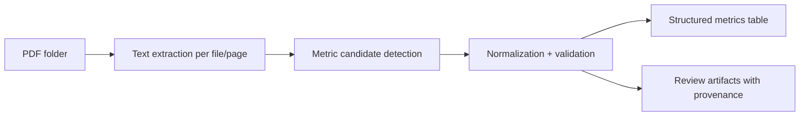

# SPEC — Sagard Portfolio Metrics Extraction

> **Status**: Draft v1 — ready for Xavier review before implementation.
> **Challenge owner**: Sagard Engineering.
> **Builder**: Xavier Medina.
> **Context**: Second-round technical discussion / build review.
> **Primary input corpus**: `../intake-pdf/*.pdf` (25 portfolio-report PDFs).

---

## 0. The one paragraph this must land

> Sagard receives quarterly PDF reporting packs from portfolio companies, but each company uses different labels, layouts, and metric definitions. The proof of concept should take a folder of PDFs, extract a small but meaningful set of portfolio-monitoring metrics, normalize them into a reviewable structure, and make the extraction easy to audit. For this challenge, the winning move is **not** to overbuild a production ETL platform; it is to show clear scoping, good judgment under ambiguity, and a credible path from messy documents to trustworthy structured data. The recommended build is a **CLI-first hybrid extraction pipeline**: use a reliable PDF-to-text layer (either a managed parser such as Firecrawl `/parse` or a local page-aware parser), run deterministic metric candidate detection and unit parsing, optionally use AI only for ambiguous label normalization, and emit CSV/JSON outputs with provenance. Azure Document Intelligence is the strongest phase-2 upgrade path for layout-heavy or scanned documents, not the day-one baseline.

---

## 1. Problem framing

### 1.1 Persona

**Primary**: A Sagard portfolio or operating team member who wants to review quarter-over-quarter company performance without manually re-reading every reporting package.

**Secondary**: An investment professional who wants to compare a small set of metrics across companies and over time.

### 1.2 Job to be done

> “Given a folder of quarterly PDF reporting packages, extract a small set of key metrics in a consistent format quickly enough that I can review performance across companies without manually transcribing each report.”

### 1.3 What the human can now do that they could not do before

- Review a portfolio-wide subset of performance metrics in minutes instead of manually transcribing PDFs
- Compare the same company over multiple quarters without re-opening each report
- Audit where a metric came from instead of trusting a black-box extraction
- Identify missing data, ambiguous labels, and company-specific reporting quirks earlier

### 1.4 What the AI / software is responsible for

1. Read the PDFs in a local folder
2. Extract text from each report reliably
3. Identify candidate metric mentions despite label variation
4. Normalize those candidates into a small canonical schema
5. Preserve provenance: company, period, file, page, original label, raw value
6. Export a structure that is easy to review and reuse (CSV/JSON and an optional markdown summary)

### 1.5 Where the automation must stop

The system should **not** pretend it has perfect semantic understanding of every metric definition. If a value is ambiguous, missing, or uses a company-specific definition, the system should surface that uncertainty explicitly rather than silently “cleaning” it into false precision.

### 1.6 Non-goals

- No production ingestion service
- No queueing, auth, or multi-user web app
- No web server or notebook-dependent workflow in v1
- No attempt to support every possible PDF quality level
- No perfect standardization of company-specific KPIs
- No forecasting or investment recommendation layer
- No cross-system integration (DealCloud, BI tools, etc.) in v1

---

## 2. Corpus observations from the provided sample

These are not guesses; they are grounded in direct inspection of the provided PDFs.

### 2.1 What the sample data looks like

- `25` PDFs in `../intake-pdf/`
- Multiple quarters for several companies (`LendBridge`, `NovaCloud`, `MediSight`, `PeopleFlow`, etc.)
- A portfolio summary document: `Portfolio_Snapshot_Q2_2025.pdf`
- Files appear machine-generated and text-extractable (sampled via `pdftotext`)
- Sample PDFs were generated by `ReportLab`, which strongly suggests a usable text layer

### 2.2 Important consequence

For **this challenge corpus**, a blanket OCR-first pipeline is probably overkill. A text-first or managed-parse-first pipeline is the fastest, lowest-risk way to produce a credible result.

### 2.3 Label drift already visible in the sample

Examples from the PDFs:

- Revenue-like labels:
  - `Recognized Revenue`
  - `Total Recognized Revenue`
  - `Quarterly Recognized Revenue`
  - `Platform Revenue (recognized)`
  - `Gross Transaction Revenue`
  - `Net Revenue (take-rate based)`
- ARR-like labels:
  - `Annual Recurring Revenue`
  - `ARR (End of Period)`
  - `Contracted ARR`
- Headcount-like labels:
  - `Total Headcount`
  - `Headcount`
  - `FTE`
- Retention / churn:
  - `Net Dollar Retention`
  - `Net Revenue Retention (LTM)`
  - `Logo Churn (LTM)`
- Cash / burn:
  - `Cash Balance`
  - `Cash & Equivalents`
  - `Cash & Restricted Cash`
  - `Monthly Net Burn`
  - `Quarterly Net Burn`
- Sector-specific metrics:
  - `Total Loan Book (gross)`
  - `Active Borrowers`
  - `Paying Entities`
  - `Contribution Margin / Shipment`

### 2.4 Design implication

The challenge is **not just extracting numbers**; it is deciding **what should be normalized**, **what should remain raw/company-specific**, and **where semantic equivalence is unsafe**.

### 2.5 Managed extraction options worth considering

Based on official product docs reviewed for this second iteration:

- **Firecrawl `/parse`** supports local PDFs, DOCX, XLSX, and HTML, returns Markdown/HTML/JSON, and offers PDF parser modes: `fast`, `auto`, and `ocr`. It is attractive for a fast CLI proof of concept because this challenge starts with a local folder of PDFs.
- **Firecrawl `/scrape`** can parse PDF URLs directly and return clean Markdown or structured JSON, but this challenge corpus is local, so `/parse` is the more relevant endpoint.
- **Azure Document Intelligence `prebuilt-layout`** can extract text, tables, headings, sections, and Markdown output with page- and bounding-region-aware layout semantics. It is the stronger production-style option for layout-heavy, scanned, or harder documents, but it adds more service setup and complexity than this challenge needs for day one.

---

## 3. Success criteria

### 3.1 Shippable definition for the challenge

- [ ] Process the provided PDF folder locally from one CLI command or one small Python script
- [ ] Extract a focused subset of high-value metrics
- [ ] Handle missing metrics cleanly
- [ ] Export a reviewable output table across company and quarter
- [ ] Preserve provenance (`file`, `page`, `label`, `raw_value`, `confidence`)
- [ ] Include a short write-up explaining approach, assumptions, and next steps

### 3.2 Quality bar

- [ ] Honest handling of ambiguity
- [ ] Clear metric taxonomy
- [ ] Reproducible local run path
- [ ] Structured output that could feed later analytics work
- [ ] Design explanation that demonstrates tradeoff awareness

### 3.3 Anti-goals

- ❌ A giant framework-heavy app for a small POC
- ❌ A notebook with no reusable extraction logic
- ❌ Blind LLM extraction with no source provenance
- ❌ Regex-only logic that breaks on trivial label drift
- ❌ Overclaiming “accuracy” without a review mechanism

---

## 4. Scope recommendation

### 4.1 Canonical metric set for v1

Recommend extracting **6 primary normalized metrics** plus **optional company-specific metrics**.

#### Primary normalized metrics

1. `revenue`
2. `arr`
3. `gross_margin`
4. `headcount`
5. `cash`
6. `net_burn`

#### Secondary optional normalized metrics

- `net_revenue_retention`
- `logo_churn`

#### Company-specific optional metrics

Keep as raw typed extensions instead of forcing false equivalence:

- `total_loan_book`
- `active_borrowers`
- `paying_entities`
- `contribution_margin_per_shipment`
- `enterprise_logos_gt_100k_arr`
- `pipeline_weighted`

### 4.2 Why this scope is right

This gives Sagard enough to review:

- scale (`revenue`, `arr`)
- efficiency (`gross_margin`, `net_burn`)
- capacity (`headcount`)
- liquidity (`cash`)
- growth quality / retention (`NRR`, churn when available)

It is broad enough to be meaningful, but small enough to implement credibly in a short exercise.

---

## 5. Recommended system design

### 5.1 High-level pipeline



### 5.2 Core pipeline stages

#### Stage 1 — PDF text extraction

- Read each PDF
- Extract text using either a managed PDF parser (Firecrawl `/parse`) or a local parser with page awareness
- Store page text for later debugging / review

#### Stage 2 — Candidate detection

- Search for metric labels using an alias dictionary
- Pair labels with nearby values
- Capture the surrounding snippet and page number

#### Stage 3 — Normalization

- Map raw labels to canonical metric names where safe
- Parse numeric values and units (`$`, `%`, `M`, `k`, `x`, `bps`)
- Preserve the raw label alongside the canonical metric
- Mark ambiguous mappings with lower confidence

#### Stage 4 — Output / review

- Long-form metrics table: one row per `(company, period, metric)`
- Optional wide table for quick human review
- Optional markdown company summary or lightweight review script

---

## 6. Architecture options and tradeoffs

### Option A — Pure rule-based extraction

#### Option A approach

- Use PDF text extraction
- Match aliases and parse nearby values with regexes
- No LLM usage

#### Option A pros

- Fastest runtime
- Cheapest
- Deterministic and easy to debug
- Strong engineering signal on reliability

#### Option A cons

- Brittle to layout variation
- Hard to generalize when labels drift semantically
- Higher implementation effort for edge cases than it first appears

#### Option A best when

- The corpus is narrow and stable
- The goal is maximum reproducibility with minimum external dependency

### Option B — LLM-first extraction from raw page text

#### Option B approach

- Convert each PDF/page to text
- Ask an LLM to extract canonical metrics directly into JSON

#### Option B pros

- Handles label drift better
- Fast to prototype
- Good at semantic normalization

#### Option B cons

- Harder to trust for numeric extraction
- Requires careful validation and provenance capture
- Risk of hallucinating missing values or over-normalizing non-equivalent metrics

#### Option B best when

- The corpus is messy and time is very short
- The interview rewards pragmatic use of modern tooling

### Option C — Hybrid extraction (**recommended**)

#### Option C approach

- Deterministic text extraction and candidate finding first
- Use a light semantic layer only for normalization / ambiguity resolution
- Validate parsed numbers with deterministic code

#### Option C pros

- Best trust / speed balance
- Easier to explain to engineering leadership
- Preserves auditability and reduces hallucination risk
- Scales better into a production-style design

#### Option C cons

- Slightly more moving parts than a notebook-only prototype
- Requires a clean contract between heuristic and semantic steps

#### Option C best when

- You want the interview answer to show both software engineering discipline and practical AI usage

### Option D — Managed document parsing (`Firecrawl /parse` or Azure Document Intelligence)

#### Option D approach

- Use a managed document service to parse PDFs into Markdown, JSON, or layout-aware output
- Keep downstream metric normalization and trust checks in your own code

#### Option D pros

- Fastest route to a credible proof of concept when time is tight
- Better upgrade path for scanned, layout-heavy, or mixed-quality PDFs
- Lets you focus the interview story on normalization, ambiguity, and provenance instead of low-level PDF parsing

#### Option D cons

- External API dependency and usage cost
- Vendor-specific behavior can weaken portability
- Some managed parsers may make page-level provenance harder than a local page-aware parser

#### Option D best when

- You have API access and want the strongest 4-hour delivery path
- You want to show pragmatic use of modern tooling without turning the whole system into a black box

### Recommendation

Choose **Option C: Hybrid extraction** with **CLI-first delivery**.

For Xavier's specific constraints, there are two strong variants:

- **Fastest interview-ready path**: Firecrawl `/parse` for local PDF-to-Markdown conversion, then deterministic metric extraction and normalization in a Python CLI.
- **Most vendor-independent path**: local page-aware parsing first, with Firecrawl or Azure DI documented as upgrade paths.

That lets you say in the interview:

> “I used deterministic extraction wherever trust matters most, and I reserved semantic tooling for normalization and ambiguity, where it adds the most value.”

That is a very director-of-engineering-friendly sentence, by the way.

---

## 7. Data model

### 7.1 Recommended long-form output schema

```json
{
  "company": "NovaCloud",
  "period": "Q2 2025",
  "metric": "arr",
  "value": 34200000,
  "unit": "usd",
  "display_value": "$34.2M",
  "raw_label": "ARR (End of Period)",
  "source_file": "NovaCloud_Q2_2025.pdf",
  "source_page": 1,
  "source_snippet": "ARR (End of Period) $34.2M",
  "confidence": 0.97,
  "notes": null
}
```

### 7.2 Why long-form first

A long-form table is better than a wide table as the primary artifact because it:

- handles sparse metrics naturally
- simplifies filtering and grouping
- supports future dashboarding
- keeps provenance attached at the row level

A wide company-by-quarter review table can be derived afterward.

---

## 8. Implementation shape for the repository

### 8.1 Recommended repo layout

```text
sagard-portfolio-metric-extractor/
├── intake-pdf/
├── outputs/
│   ├── metrics_long.csv
│   ├── metrics_long.json
│   └── review_table.csv
├── portfolio_metrics/
│   ├── __init__.py
│   ├── cli.py
│   ├── extract_text.py
│   ├── detect_metrics.py
│   ├── parser_firecrawl.py
│   ├── parser_local.py
│   ├── normalize.py
│   ├── pipeline.py
│   └── schemas.py
├── tests/
├── README.md
└── plan/
    └── PLAN.md
```

### 8.2 Delivery shape recommendation

For this challenge, the best balance is:

- **CLI or small Python script** for extraction and output generation
- **CSV/JSON outputs** for reviewability
- **No server and no notebook required** for the baseline submission
- **Optional markdown summaries** if you want a more interview-friendly review surface

---

## 9. Evaluation and trust

### 9.1 Minimum review loop

For a credible POC, every output row should preserve:

- canonical metric
- raw label
- parsed value
- source file
- source page
- confidence

### 9.2 Lightweight validation plan

Hand-check a small gold set, e.g.:

- 4 PDFs
- 6 core metrics each
- ~24 expected rows

Measure:

- extraction recall: did the system find the metric when present?
- parsing accuracy: did it parse the numeric value correctly?
- normalization accuracy: did it map the label safely?

### 9.3 Important interview point

Do **not** claim exact accuracy percentages unless you actually measured them. It is better to say:

> “For the exercise, I built the pipeline so it is easy to validate and improve, rather than claiming perfect extraction from day one.”

---

## 10. Risks and mitigations

| Risk                          | Why it matters                                                                               | Mitigation                                                                             |
| ----------------------------- | -------------------------------------------------------------------------------------------- | -------------------------------------------------------------------------------------- |
| Semantic non-equivalence      | `Revenue`, `Gross Transaction Revenue`, and `Recognized Revenue` may not mean the same thing | Keep `raw_label`, only normalize where definitions are safe, document assumptions      |
| Missing metrics               | Not every PDF contains every metric                                                          | Sparse long-form schema; do not force null-filled wide outputs as the primary artifact |
| Unit parsing errors           | `$34.2M`, `121%`, `2.7x`, `+148bps` have different semantics                                 | Unit-aware parser and typed metric schema                                              |
| Portfolio summary duplication | `Portfolio_Snapshot_Q2_2025.pdf` may duplicate standalone metrics                            | Treat summary docs separately or flag them as `document_type=portfolio_summary`        |
| Future scanned PDFs           | Real-world reports may not have a text layer                                                 | Document OCR as phase-2 fallback, not day-1 baseline                                   |
| Hallucinated normalization    | LLM could over-map company-specific metrics                                                  | Keep deterministic validators and explicit confidence scoring                          |
| Managed-parser dependency     | Firecrawl or Azure DI can reduce implementation time but add cost and vendor coupling        | Keep parser interface small and make the downstream normalization/parser swap-friendly |

---

## 11. Interview-ready tradeoff summary

If asked “why this approach?”, the crisp answer is:

1. **The sample PDFs are parseable enough that I did not lead with OCR.**
2. **The real challenge is label normalization and trust**, not raw PDF decoding.
3. **I chose a hybrid CLI design** so the extraction is auditable and reproducible, while still leaving room for managed parsing or semantic normalization where they help.
4. **I kept the metric taxonomy intentionally small** because the prompt rewards good scoping more than breadth.
5. **I preserved provenance** so a Sagard user can review extracted numbers without blindly trusting the system.

---

## 12. Working decisions from Xavier's answers

These decisions are now effectively locked for the second iteration of the plan:

- Time budget is roughly **4 hours**, split across tonight and tomorrow morning if needed.
- Optimize for **challenge compliance first** and **interview storytelling second**, with storytelling carrying more weight.
- Deliver a **script / CLI / small Python program**, not a server and not a notebook-dependent workflow.
- Extract **6 metrics well**, and treat lower-confidence or company-specific metrics as future work.
- Treat `Portfolio_Snapshot_Q2_2025.pdf` as a **normal input**, while acknowledging possible duplication or ambiguity.
- External APIs are acceptable for the demo; **OpenAI** and **Firecrawl** are available.
- Keep it as a **normal repo** with `.env` protected from Git.
- The preferred architecture is **hybrid**.
- Default parser posture is **Firecrawl-first**, while keeping local-parser and Azure DI tradeoffs documented.
- Azure Document Intelligence stays in scope as a **documented option only**, not a day-one implementation path.

### Remaining open questions

1. Do we lock the baseline metric set as the **core six** (`revenue`, `arr`, `gross_margin`, `headcount`, `cash`, `net_burn`) with **`net_revenue_retention` as the first optional extension**, or do you want to swap one of the core six out for NRR?
2. Is **page-level provenance** a hard requirement even if a managed parser makes it slightly harder to preserve?

---

## 13. What is deliberately not in this SPEC

- Exact library lock-in
- Exact CLI shape
- Exact notebook content
- Exact prompt text if an LLM is used
- Production deployment design

Those belong in the implementation plan and can stay flexible.

---

## 14. Production graduation path

If this proof of concept graduates beyond the take-home, the most credible path is:

1. **Today — synchronous CLI**

- good enough for a local folder of 25 PDFs
- generates immutable CSV/JSON outputs and a confidence-aware review artifact

1. **Next — asynchronous batch processing**

- one job per PDF or per batch
- immutable raw parser output stored before normalization
- low-confidence rows routed to human review rather than silently accepted

1. **Then — serverless orchestration**

- object storage trigger or scheduled upload
- queue-based fan-out because PDF parsing and OCR are bursty workloads
- ideal shape: async worker model or serverless job, not a synchronous request/response web flow

1. **Later — BI and workflow integration**

- push normalized outputs into a dashboard, warehouse, or portfolio-ops workflow
- track extraction drift, missingness, and confidence over time

The non-negotiable production point is: **it must become asynchronous**. PDF parsing, OCR fallback, and vendor calls are too bursty and latency-variable to keep as a synchronous user-facing workflow at scale.
